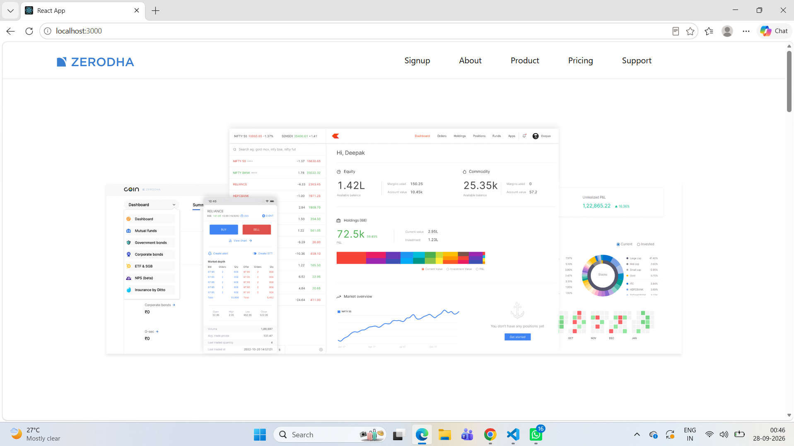
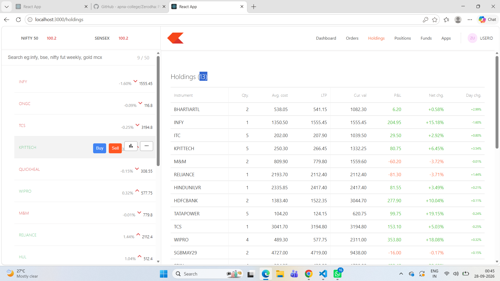

# Zerodha Clone

A full-stack stock trading web application inspired by the user interface and core workflow of Zerodha. This project was developed as a learning project to practice React.js, Node.js, Express.js, MongoDB, authentication, REST APIs, and Git/GitHub.

> **Disclaimer:** This is an educational project. It is not affiliated with, endorsed by, or connected to Zerodha, and it is not intended for real financial transactions.

## 📸 Screenshots

### Landing Page



### Trading Dashboard - Holdings



## ✨ Features

### Landing Page
- Home page
- Navigation bar
- About section
- Products section
- Pricing section
- Support section
- Signup page

### Trading Dashboard
- Dashboard overview
- Stock watchlist
- Stock search
- Buy action interface
- Sell action interface
- Holdings
- Orders
- Positions
- Funds
- Apps section

### Backend
- User registration/authentication
- JWT-based authentication
- Password hashing
- MongoDB database integration
- Holdings management
- Orders management
- Positions management
- REST API endpoints

## 🛠️ Technologies Used

### Frontend
- React.js
- JavaScript
- HTML
- CSS

### Dashboard
- React.js
- JavaScript
- HTML
- CSS

### Backend
- Node.js
- Express.js
- MongoDB
- Mongoose
- JWT
- bcryptjs

### Development Tools
- Git
- GitHub
- Visual Studio Code
- npm

## 📁 Project Structure

```text
Zerodha-Clone/
│
├── backend/
│   ├── Controllers/
│   │   └── AuthController.js
│   ├── Routes/
│   │   └── AuthRoute.js
│   ├── model/
│   │   ├── HoldingsModel.js
│   │   ├── OrdersModel.js
│   │   ├── PositionsModel.js
│   │   └── UserModel.js
│   ├── schemas/
│   │   ├── HoldingsSchema.js
│   │   ├── OrdersSchema.js
│   │   └── PositionsSchema.js
│   ├── SecretToken.js
│   ├── index.js
│   ├── package.json
│   └── package-lock.json
│
├── dashboard/
│   ├── public/
│   ├── src/
│   │   ├── components/
│   │   └── data/
│   ├── package.json
│   └── package-lock.json
│
├── frontend/
│   ├── public/
│   ├── src/
│   │   ├── landing_page/
│   │   ├── index.css
│   │   └── index.js
│   ├── package.json
│   └── package-lock.json
│
├── screenshots/
│   ├── landing-page.png
│   └── dashboard-holdings.png
│
├── .gitignore
└── README.md
```

## ⚙️ Installation and Setup

### 1. Clone the repository

```bash
git clone https://github.com/shivani-rajput03/Zerodha-Clone.git
cd Zerodha-Clone
```

### 2. Set up the backend

Open a terminal in the project folder and run:

```bash
cd backend
npm install
```

Create a file named `.env` inside the `backend` folder.

Add your own MongoDB connection string and JWT secret:

```env
MONGO_URL=your_mongodb_connection_string
TOKEN_KEY=your_secret_key
```

Do **not** upload the `.env` file to GitHub.

Start the backend:

```bash
node index.js
```

The backend is configured to run on port `3002`.

### 3. Set up the frontend

Open another terminal:

```bash
cd frontend
npm install
npm start
```

The frontend is a React application. Create React App may use port `3000` or another available port depending on what is already running.

### 4. Set up the dashboard

Open another terminal:

```bash
cd dashboard
npm install
npm start
```

The dashboard is also a React application, so if another React application is already using port `3000`, React will ask to use another available port.

## ▶️ Running the Project

Run the applications separately:

**Backend**
```bash
cd backend
node index.js
```

**Frontend**
```bash
cd frontend
npm start
```

**Dashboard**
```bash
cd dashboard
npm start
```

Keep the backend running while using features that communicate with the API.

## 🔐 Environment Variables

The backend requires environment variables such as:

```env
MONGO_URL=your_mongodb_connection_string
TOKEN_KEY=your_secret_key
```

For security:

- Never commit `.env` to GitHub.
- Never expose your MongoDB password.
- Never expose private API keys or authentication secrets.

## 📚 Learning Objectives

This project helped in learning and practicing:

- React.js component development
- React routing and UI design
- Node.js and Express.js
- REST API development
- MongoDB and Mongoose
- User authentication
- JWT authentication
- Password hashing
- Frontend-backend communication
- Git and GitHub
- Project organization and version control

## 🚀 Future Improvements

Possible future enhancements include:

- Real-time market data
- Improved order execution workflow
- Complete buy/sell transaction flow
- Portfolio analytics
- Better responsive design
- Advanced charts
- Notifications
- Improved security and validation

## 👩‍💻 Author

**Shivani Rajput**

- GitHub: [shivani-rajput03](https://github.com/shivani-rajput03)
- LinkedIn: [Shivani Rajput](https://www.linkedin.com/in/shivani-rajput-042046342)

## 📄 License

This project is intended for educational and personal learning purposes.
